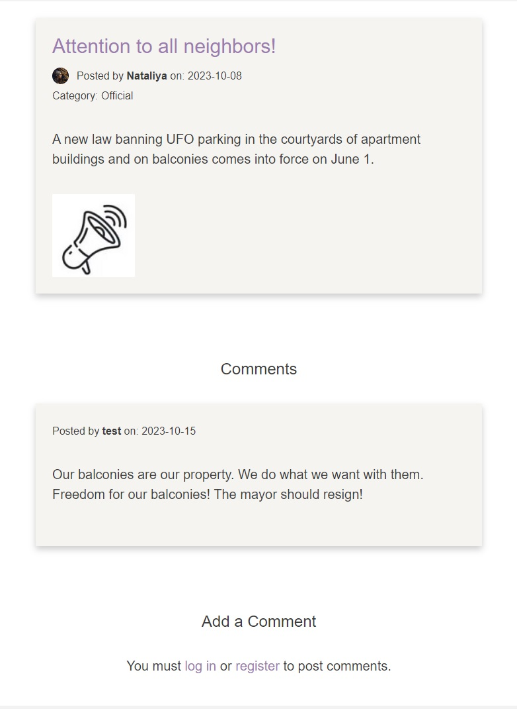
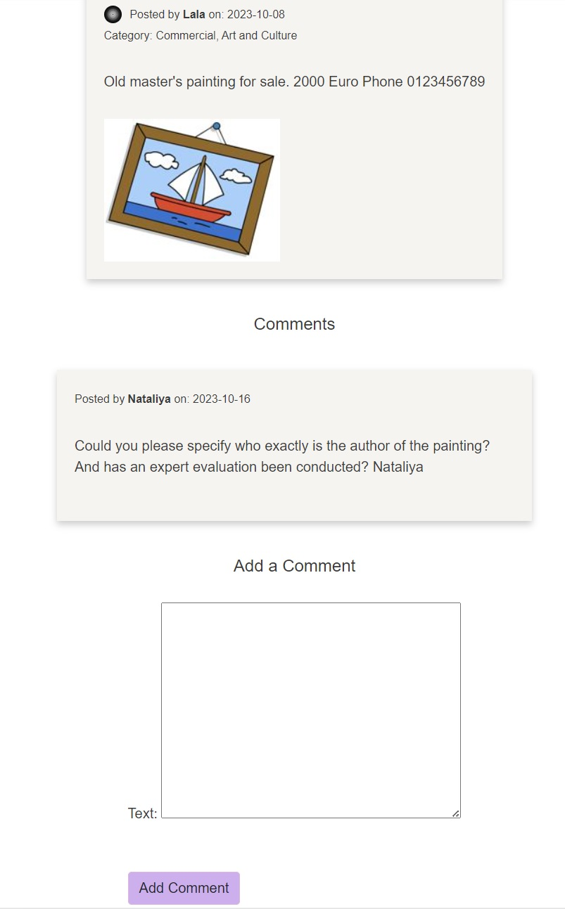

# Local buzz
This Django project offers an opportunity for the local community to share news in an informal setting. The website combines the features of a bulletin board with casual news sharing between neighbors, like a friendly chat on the street. Topics are not restricted, as long as they fall within the bounds of common sense and decency, which are overseen by the site administrator. Anyone can post news or an advertisement, express their opinions, or simply respond to a post by leaving a comment. However, to take an active part in the life of this online community, one must become a member by registering.

[Link to live site](https://herokuapp.com/)

## Table of Contents
- [Site Goals](#site-goals)
- [UI/UX](#uiux)
    - [Agile Methodology](#agile-methodology)
    - [Wireframes](#wireframes)
    - [5 Planes of UX](#5-planes-of-ux)
    - [Visual Design Choices](#visual-design-choices)
        - [Colour Scheme](#colour-scheme)
        - [Images and Icons](#images-and-icons)
        - [Fonts](#fonts)
- [Features](#features)
    - [Existing Features](#existing-features)
    - [Security Features and Defensive Design](#security-features-and-defensive-design)
    - [Future Features](#future-features)
- [Database Design](#database-design)
    - [Database Model](#database-model)
    - [Custom Model](#custom-model)
    - [CRUD](#crud)
- [Frameworks - Libraries - Programs Used](#frameworks---libraries---programs-used)
- [Testing](#testing)
- [Unfixed Bugs](#unfixed-bugs)
- [Deployment - Heroku](#deployment---heroku)
- [Development](#development)
    - [Fork](#fork)
    - [Clone](#clone)
    - [Download ZIP](#download-as-zip)
- [Languages](#languages)
- [Frameworks - Libraries - Programs Used](#frameworks---libraries---programs-used)
- [Source Credits](#source-credits)
- [Acknowledgments](#acknowledgments)

### Site Goals
This website represents a compromise between real bulletin boards, live direct communication with neighbors, and the capabilities of modern technology. It expands the possibilities of messenger groups. Here, people can not only post or obtain the information they need, comment, edit, and delete it, but also search and sort it by keywords, author, and view all their published announcements on one page. In the basic version of the website, the administrator has the ability to remove inappropriate content. The developer plans to add the ability for private comments, visible only to the author of the announcement, which should make the atmosphere of information exchange on the site even more confidential (informal).

## UI/UX

The overall design of the website should create an atmosphere of casual, informal neighborly communication. To achieve this, minimal necessary features and interactivity are configured to avoid overwhelming the user with a large number of options. The general layout, navigation, and functionality are simple and intuitive, aligning with user expectations for any standard blog website.

### Agile Methodology and User Story

Agile was used from the initial planning stage for this project. You can find more information about my development planning as well as User Story in the project I created on GitHub [here](https://github.com/users/1101712/projects/1). In it, I employed the provided Kanban board method to divide project elements into user stories and manageable tasks. The plan presented in the project represents the optimal version with features, some of which I was unable to implement due to time constraints.

### Wireframes

The initial [wireframes in Figma](https://www.figma.com/file/w9czEkU8kcSVDod6AMa5Fu/Local-Talks?type=design&node-id=0%3A1&mode=design&t=OijBKnG8otwAM68t-1) serve as a simplified blueprint of the final product and are primarily intended for planning the website's core functionalities. You can view the wireframes by following this link and selecting the desired pages from the menu at the top left, next to the palm icon. The free version of the site offers only 3 pages for wireframe development.

Not all features are covered by these initial sketches. For a comprehensive list of existing features, please refer to the [Features](#features) section.

### 5 Planes of UX

#### Strategy

The goal is to meet the needs of local communities for a dedicated space where they can share news, advertisements, and general community information in an informal, yet organized manner. Unlike social media or e-commerce platforms, the focus here is on local, neighborly interaction.

#### Scope

The project aims to provide essential features that facilitate easy interaction among community members. These include:
- User Authentication: Sign up and login functionality.
- News and Ads Posting: CRUD operations for authenticated users.
- Search and Sort: Enables users to find posts by keywords, categories, and authors.
- Profile Page: A user-specific page where one can view all their posts.

For a comprehensive overview of all the features currently implemented, see [Existing Features](#existing-features). Additional functionalities that have not yet been implemented, primarily due to time constraints, are discussed under [Future Features](#possible-future-features).

#### Structure

The site is modeled after a simple blog or bulletin board, offering intuitive navigation. Users can browse posts and perform advanced operations like searching and sorting. However, to post an ad or news, user authentication is required.

#### Skeleton
The initial outline of the project's skeleton can be viewed in Wireframes. The structure is designed to offer intuitive navigation through a familiar layout:

- The navbar provides quick access to all     primary features and varies according to user authentication status.
- The main content is displayed in a listview, and each post links to its details.
- Buttons and links are clearly labeled, and instructions are provided where necessary.

#### Surface

The visual design aims to create an atmosphere of informal, neighborly interaction. The layout is clean and straightforward, devoid of any elements that could potentially overwhelm the user. For more details on the visual planning, see [Visual Design Choices](#visual-design-choices).

### Visual Design Choices

### Colour Scheme:
Colour palette from [ASPOSE](https://products.aspose.app)

The colours chosen are quite neutral and calming. 

Great care was taken to establish a good contrast between background colours and text at all times to ensure maximum user accessibility.

### Images and Icons

The design of the site includes images and icons made in the style of children's drawings. This style was chosen intentionally. The aim of using such images and icons is to create an atmosphere of trust and openness. 

We want every visitor to our site to feel comfortable and not have the sensation that they are being manipulated or used for commercial purposes. The style of children's drawings contributes to a subconscious feeling of immediacy and sincerity, making the interaction with the site more pleasant and trustworthy.

### Fonts

[PT Font Family](https://company.paratype.com/pt-sans-pt-serif)

The fonts from the PT Family were chosed to make the website futureproof. As already mentioned, I plan on adding multilanguage support to this project, and the Paratype fonts are built around non-latin characters, such as the Cyrillic alphabet and special charachters used in post-Soviet countries, which are very rare to find in fonts produced in the anglophone world. While dealing with an impressive amount of letters from different language families, the PT font never compromises on aestetics - it has been created by the internationally acclaimed typeface designer [Alexandra Korolkova](https://en.wikipedia.org/wiki/Alexandra_Korolkova) and Olga Umpelova.

## Features

### Existing Features

#### Navigation
- Navbar with nav links and search
- Different links visible for authenticated and unauthenticated users
- Active link rendered bald
- Collapsible burger menu with drop-down on small to medium screens

#### Сategory Panel
- Panel with links to ads by category
- The category that the mouse hovers over is    
  highlighted in purple
- Collapsible burger menu with drop-down on small to medium screens

#### Ads by Categories Page

The page for all ads by categories is designed in a consistent style and displays all ads in the category selected by the user.

#### Home Page

Add Listing Button: Different text is displayed for authenticated and unauthenticated users. Unregistered users are informed that they need to register in order to post an ad.

Only the latest 6 listings are displayed. On their own ads, the user sees links to the option to edit or delete the ad. 

The ad title is an active link to the ad's individual page.
In the listing box, you can see the title, a mini-profile picture icon or a default image, information about the author, the publication date, and the category, as well as an image uploaded by the author or a default image. The ad is not limited in character count, but it is restricted in how much text is displayed in the listing field. To view the entire text, a scrolling feature is utilized.

Default images are included to maintain a consistent style.
Unlogged users cannot see the edit or delete ads buttons.
At the bottom of the main page, below the first 6 ads, there is a link to the page with all ads. It is designed in the  the same for all links way — purple in color and underlined when hovered over with the mouse.

#### Footer

In the footer, you can find contact information: the site admin's email, which is also a link styled in the same way — purple and underlined when hovered over with the mouse.

#### All Ads Page

In addition to the main page, which displays only the first 6 listings, we have created a dedicated 'All Ads' page. It has a design similar to the main page, with a few subtle differences.The purpose of this page is to provide users with access to the entire range of listings without any limitations. This way, users can explore more options and find exactly what they are looking for. 

Just like on the main page, this page also features an 'Add Listing' button, styled identically for a consistent user experience. 

The page starts with the heading 'All Ads' and displays 6 listings at a time, similar to the main page. To navigate through multiple listings, pagination is available at the bottom of the page. The current page in the pagination is highlighted in the same color as the category panel, for a unified visual experience.

From a development perspective, having a dedicated 'All Ads' page offers several advantages. First, it helps in optimizing performance; the main page can load faster as it only needs to fetch and display a limited number of listings. This is especially beneficial for users with slower internet connections. Secondly, it provides a more modular approach to development. Features like sorting, filtering, and advanced search can be implemented on the 'All Ads' page without cluttering the main page, making the codebase easier to manage and extend. Lastly, it allows for more targeted analytics. By tracking user interactions on the 'All Ads' page separately, developers can gain insights into user behavior that can be used for future improvements. Overall, the 'All Ads' page not only enhances the user experience but also provides a more manageable and scalable solution for developers.

#### Registration Page

Here, the user is required to fill out an extended standard form with a username and email. The user must also choose a password and confirm it. Optionally, as a non-mandatory feature, the user can upload an image for their profile, which will then be automatically resized to fit specified parameters. Unlike other required fields, the form allows the user to skip the image upload. In this case, the system will use a default image.

#### Dynamic hints

In addition to the form fields, the registration page features dynamic hints to assist users in filling out their email and password. These hints serve as error prompts, helping users understand the requirements for each field. The hints are implemented using JavaScript and are displayed below the input fields.
Password Hints

- For the password, 

    the following conditions are displayed to the user as they type:

        The password must be at least 8 characters long.
        It should contain at least one uppercase letter.
        It should contain at least one lowercase letter.
        It should contain at least one number.
        It should contain at least one special character (such as @, $, !, %, *, ?, &, #).

    The hint text dynamically shrinks as the user meets each of these requirements.
    Confirm Password

    When the user is confirming their password, real-time validation occurs. The hint for this field operates on an error principle and will display a message until there is an exact match between the entered passwords.
    Email Hints

- For the email field, 

    the following conditions are displayed:

        The email must contain an '@'.
        The email must contain a '.'.
        The email should be in a valid domain format.

    The hint text for the email also dynamically updates based on user input, guiding them to meet the email format requirements.

The hints are styled with a specific color (#76161eda) to ensure they are noticeable yet not too distracting. These interactive features make the registration process more user-friendly by providing immediate feedback and guidance.

- Email Already Exists Scenario

    After the user submits the form, the back-end logic in Django checks whether the provided email already exists in the database. This is done in the RegisterView class within the form_valid method. If a user attempts to register with an email that already exists, a message will be displayed to inform them that a user with that email already exists. The user will then be redirected back to the registration page to correct this issue.

After successful registration, the user is redirected to the newly created profile page. Therefore, there is no need for an additional message about successful profile creation.

With these added features, the registration page becomes not only a gateway for new users but also a comprehensive, user-friendly interface that guides users through the process, helping them correct errors and understand requirements.

#### Login 

In the application, users can securely log in through an authentication process. Additionally, if a user forgets their password, the system provides a password reset functionality to help them regain access to their account.

Initially designed to send an email for password reset functionality, the feature has been adapted due to difficulties with sending emails from Gitpod. 

#### Profile Page

User's Listings Page (also known as Profile Page)
This page is designed in a consistent style, but without Ad Category panel. The page is accessible only to registered and authenticated users. If a user is not authenticated, they will be prompted to log in or register. Authenticated users see a greeting with their name on their page, their rounded profile image links to edit or delete their profile, a link to add a new listing, and all the listings they have published with options to edit or delete each listing. All links are styled in the same way — purple and underlined when hovered over with the mouse — consistent with the overall site design.

#### Profile Editing Page

The user can change or delete their uploaded image. If the image is deleted, it will be replaced with a default image. After completing the editing process, the user will see a message indicating the successful completion of the profile edit. The user will be redirected back to their profile page.

#### Profile Deletion Page

The user can delete their profile. Before finalizing the deletion, the user will need to confirm their intent to delete the profile. After clicking the confirmation button again, the user will see a message stating that their profile has been deleted. The user will be redirected to the Home Page.

#### Ad Creation
 
Only a registered and authorized user can create an ad. On the ad creation page, the user is prompted to come up with a title, create the text, optionally add an image, and select one or more categories. The layout of the ad creation field follows the style of the ad itself. After the successful creation of the ad, the user is redirected to the page displaying all ads, where they can see their newly published ad, as well as receive a message confirming the successful creation of the ad.

#### Ad Editing

Only the authorized author of the ad can edit it. If necessary, the user can make changes to any previously selected fields except for categories. To change categories, the user will need to delete the current ad and create a new one. The layout of the ad editing field also follows the style of the ad itself. After successfully editing the ad, the user is redirected to their profile page, where they can see all of their ads and receive a message confirming the successful update of the ad.

#### Ads Page with ad details and comments

The user is redirected to this page when they click on the title of the ad, which is an active link. The ads page is designed in a consistent style, but without Ad Category panel. Here, in addition to the ad itself, all comments on the ads are visible. Depending on whether the user is authenticated, they may or may not see text with links inviting them to log in or register in order to leave a comment, as well as links with the option to delete a comment.

This is how the page looks for a user who has left a comment:

 

This is how the page looks for a user who is not authenticated:

This is how the page looks for a user who is neither the author of the ad nor the author of the comment:

#### Comment Edition and Deletion

On the page of the ad to which the user has left a comment, provided that the user is authenticated, the user can delete their comment and, if necessary, write a new one. Only the authorized author of a comment has the right to delete it. Before finalizing the deletion, the user will need to confirm their intent to delete the comment. After deleting the comment, the user will see a message confirming that their comment has been deleted. The user will be redirected back to the ad page to which the comment was just deleted.

I intentionally did not add the ability to edit comments, as I fundamentally believe that editing should come with the ability to view comment history, which would take too much time within the scope of this educational project. However, such an option should definitely be implemented in the future.

#### How It Works Page

This page  introduces a comprehensive "How it Works" guide aimed at helping users navigate and make the most out of the "Local Buzz" platform. The guide covers everything from account creation and management, using default images, posting ads, to interacting with other users through comments. It explains how to use  default images for profiles and ads, categorized view for easier navigation, and efficient search functionality.

### Security Features and Defensive Design

#### Authentication and Authorization:

- **Custom User Model:** 
    
    The application uses a custom user model CustomUser with unique email constraints.

- **Login Required:** 

    Several views like ProfileView, ProfileEditView, ProfileDeleteView, etc., are protected by Django's LoginRequiredMixin, ensuring that only authenticated users can access these views.
- **Ownership Checks:** 

    For deleting comments (CommentDeleteView), the application checks if the user attempting to delete the comment is indeed the author.

#### Database Security

- The database url and secret key are stored in the env.py file to prevent unwanted connections to the database. Due to an oversight, the database URL and secret key were initially committed to GitHub. However, all passwords and keys have since been regenerated. They are now stored in an env.py file, which is included in the .gitignore to prevent unwanted access to the database.

#### User Input Handling:

- **Form Validation:**

    Django forms (CommentForm, AdForm, etc.) are used to validate user input before saving it to the database. 

- **Real-Time Form Validation:**

    Dynamic Hints: The application provides real-time hints during the process of filling out the registration form. The hints are generated by JavaScript and displayed below the input fields for password and email.

- **Password Complexity:**

    The JavaScript code enforces password complexity requirements, ensuring that the password contains a mix of uppercase letters, lowercase letters, numbers, and special characters. This helps improve the security of user accounts.

- **Password Confirmation:**

    A real-time check is performed to make sure the confirmed password matches the initial password. This minimizes the risk of users setting unintended passwords.

- **Email Format Validation:**

   The JavaScript code validates the email format in real-time, providing hints about missing '@' or '.' symbols or if the overall format does not match the required email format.

- **Escaping User Input:**

   The function highlight_text is designed to highlight text in search results, which could help in preventing issues related to HTML injection if properly used.

#### File Handling:

- **Image Resizing:** 

    Both for user profile pictures and ad images, the application resizes images to specified dimensions, potentially saving storage and bandwidth.

- **Default Image:** 

    In the absence of a user-provided image, a default image is used.

- **Image Deletion:** 

    Old images are deleted from storage when updated, preventing storage from being filled with unused images.

#### Messages:

- **User Feedback:**
    
    Uses Django's messaging framework for providing feedback like 'Profile updated successfully', etc., which is a good practice for UX but also can be seen as a security feature to confirm the action.

- **Error Feedback:**

     Real-time feedback is not just a user experience feature but also a security measure, as it guides users to input data in a secure and correct format, thus reducing the chances of error or security vulnerability.

#### Signals:

- **Post-save and Post-delete Signals:**
    
    Utilizes Django's signal mechanism to handle related activities post-save and post-delete, like creating a user profile or deleting associated images.

#### Others:

- **Pagination:**

    The application uses Django's built-in pagination features to limit the number of displayed ads, which can prevent Denial of Service (DoS) attacks aimed at database exhaustion.

#### Notes:

Although the application has CSRF protection enabled by default (thanks to Django), it's not explicitly mentioned in the code. Database queries are generally well-parameterized to avoid SQL injection. The application uses Django's built-in password validators for increased security. 

While these practices enhance security, it's crucial to note that they are part of a layered security strategy and should not be relied upon as the only means of securing an application.

### 🚀 Future Features

#### For Users
- **Comment Edit History:** 

    Allow users to view the history of their edited comments.

- **Notification for Comments:** 
    
    Users will receive a notification when someone comments on their post.

- **Private Commenting:** 

    Enable the option for comments to be private, visible only to the author of the post.

#### For Admins
- **New Post Alerts:** 

    Admins will be notified of new posts.

- **User Management:** 
    
    Admins will have the ability to ban users and send them personal messages or warnings about undesirable actions.

#### General Enhancements

- **Pagination:** 

    Implement pagination for profile pages and for listing posts by categories or search results.

- **Location Mapping:** 

    Allow users to add a location related to the post on a map.

#### Security

Django provides a robust foundation for building secure web applications. However, there are additional measures that can further enhance security:

- **Two-Factor Authentication:** 

    Implement 2FA to enhance user security.

- **Rate Limiting:** 

    Implement rate limiting on API and user routes to improve security against brute-force attacks.
- **Two-Factor Authentication (2FA):**

    Implementing 2FA can add an extra layer of security during user logins.

- **Rate Limiting:**

    To safeguard against abuse, rate limiting can be applied to API and user routes.

- **Data Validation:**

    It is advisable to validate data on both client and server sides for additional security.

- **Logging and Monitoring:**

    Robust logging mechanisms can help in tracking unauthorized access or other security incidents.
    
- **Regular Updates:**

    Keeping all packages up to date is essential for benefiting from the latest security patches.

With the use of class-based views and existing user authentication mechanisms, these security features can be seamlessly integrated into the current codebase.

## Database Design

### Database Model

- **CustomUser and UserProfile:**

One to One (OneToOneField). Each CustomUser has exactly one UserProfile. This extends the user information by adding additional fields such as bio.

- **CustomUser and Ad:**

One to Many (ForeignKey). A single user (CustomUser) can create multiple ads (Ad), but each ad belongs to only one user.

- **CustomUser and Comment:**

One to Many (ForeignKey). One user can leave multiple comments (Comment), but each comment belongs to only one user.

- **Ad and Category:**

Many to Many (ManyToManyField). One ad can belong to multiple categories, and one category can contain multiple ads.

- **Ad and Comment:**

One to Many (ForeignKey). One ad can have multiple comments, but each comment belongs to only one ad.

- **Signals**

After saving CustomUser, a UserProfile is automatically created.

Before saving edeted  CustomUser with new profile picture, the old profile picture is deleted.

After deleting Ad, its picture is deleted.

After deleting CustomUser, all of its pictures and ads are deleted.

This structure provides a flexible and scalable way to manage users, ads, and comments, as well as their interrelationships.

The database model diagram was designed using [Drawio](https://app.diagrams.net/).
The first draft of the entity relationship diagram does not include all models and connections used in the final database.

## Deployment - Heroku
(x)

## Forking this repository
(x)

## Cloning this repository
(x)

## Languages
(x)

## Frameworks - Libraries - Programs Used
(x)

## Credits
(x)

## Acknowledgments
(x)